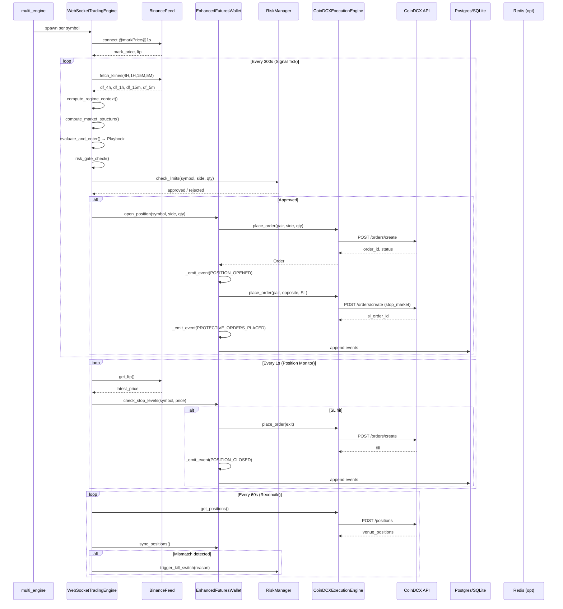

# Crypto Trader — Runtime Architecture & Lifecycle

> Complete flow of trading automation, state persistence, and restart behavior.

---

## 1. Entry Points

There are four ways to launch the system. All converge on the same core runtime.

| Script / Command | Purpose |
|---|---|
| `./bin/start` | **Production launcher.** Spins up Docker infra (Postgres, Redis), starts the Dashboard API on `:8088`, then runs `multi_engine.py` in the background. Defaults to `MODE=paper`. |
| `./bin/bot` | **Lightweight bot-only.** Ensures Docker infra is up, then runs `multi_engine.py`. |
| `./bin/dev` | **Development mode.** Starts infra + Dashboard API (`:8088`) + Execution Consumer (background). Bot is started separately. |
| `python -m crypto_trader.multi_engine` | **Core multi-symbol runtime.** Parses `--symbols` / `watchlist.yaml`, builds one `WebSocketTradingEngine` per symbol, runs them in daemon threads with a shared `EnhancedFuturesWallet` and `RiskManager`. |
| `python -m crypto_trader.engine_live` | **Gated single-symbol live entry.** Runs a startup self-test (credentials, market data, reconciliation, safe-mode gate). Refuses to trade if any critical check fails. |

`multi_engine.py` acquires a file lock (`/tmp/crypto_trader_multi_engine.lock`) to prevent duplicate instances.

---

## 2. Startup Sequence

### 2.1 Configuration & Safety Gates

1. **Load `.env`** → `TradingConfig` (leverage, risk limits, mode, symbols)
2. **Lock file check** — prevents duplicate `multi_engine` instances
3. **Safe-mode gate** — live trading requires:
   - `MODE=live`
   - `LIVE_TRADING_ENABLED=true`
   - `LIVE_TRADING_ACK="I_UNDERSTAND_REAL_MONEY_WILL_BE_LOST"`
   - No `HALT` file present

### 2.2 Fresh Start vs Restart

#### Fresh Start (no prior state)
- `EnhancedFuturesWallet` emits a `WALLET_INITIALIZED` event
- Balance starts at `initial_balance` (from `.env` or CLI)
- No positions exist; `can_open()` returns `True`

#### Restart (state recovery)

The wallet runs `_load_state()` in this exact order:

```
1. DB snapshot + delta replay   (preferred)
   ├─ Load latest snapshot from Postgres/SQLite
   ├─ Replay all events newer than snapshot via PortfolioReducer
   └─ Measure recovery_latency_ms

2. File snapshot fallback
   ├─ Read wallet_{ns}_{symbol}.json
   ├─ If corrupt, fall back to .bak.json
   └─ SHA256 integrity check

3. Runtime sync
   ├─ _sync_positions_from_reducer()
   ├─ _sync_orders_from_reducer()
   └─ _sync_fills_from_reducer()

4. Parity check
   └─ assert_runtime_matches_replay()
      Compares runtime balances, positions, SL prices, orders, fills
```

---

## 3. State Persistence

### 3.1 What IS Persisted

| Data | Storage | Purpose |
|---|---|---|
| **Event log** | Postgres `events` table or `.jsonl` file | Append-only source of truth |
| **Wallet balance** | DB snapshot + event replay | Capital base, realized PnL |
| **Positions** | DB snapshot + `POSITION_OPENED/ADOPTED/CLOSED` events | Open & closed positions with SL/TP/trailing state |
| **Orders** | DB snapshot + `ORDER_CREATED/FILLED/CANCELLED` events | All order lifecycle states |
| **Fills** | DB snapshot + fill events | Historical fill ledger with fees |
| **Risk state** | `~/.crypto_trader/risk_state.json` | Kill switch, daily counters, peak balance |
| **Snapshots** | Postgres `snapshots` table + `.json` file | Compressed `PortfolioState` dumps for fast recovery |

### 3.2 What is NOT Persisted (Ephemeral)

- WebSocket connection state / order book depth
- In-flight LLM advice threads
- Cached kline DataFrames
- Redis cache (rebuildable by design)

### 3.3 Storage Layers

| Layer | Format | Path / DSN |
|---|---|---|
| **Primary** | Postgres | `DATABASE_URL` |
| **Fallback** | SQLite (WAL mode) | `~/.crypto_trader/wallet_{ns}_{symbol}.db` |
| **Event log** | JSONL | `~/.crypto_trader/wallet_events_{ns}_{symbol}.jsonl` |
| **File snapshot** | Gzipped JSON | `~/.crypto_trader/wallet_{ns}_{symbol}.json` |
| **Risk state** | JSON | `~/.crypto_trader/risk_state.json` |

---

## 4. Full Data Flow

### 4.1 Market Data Ingestion

```
┌─────────────────────────────────────────────────────────────────┐
│  DATA SOURCES                                                   │
│  • Binance REST: 4H/1H/15M/5M klines, funding, OI, taker ratio │
│  • Binance WS: @markPrice@1s, @bookTicker, @kline_*            │
│  • CoinDCX REST: execution, positions, balances (live only)    │
│  • CoinDCX WS (opt): user stream fills / balance updates       │
└─────────────────────────────────────────────────────────────────┘
```

### 4.2 Signal Generation Tick (every 300s / 5 min default)

```
1. _fetch_market_data()
   └─ df_4h, df_1h, df_15m, df_5m, mark_price, funding_rate, oi_data

2. _compute_regime_context()
   └─ MarketRegime, regime_score, rVol, ADX, RegimeContext

3. _compute_market_structure()
   └─ SMC structure (BOS, Order Blocks, FVG)

4. _start_llm_async()
   └─ OllamaAdvisor (non-blocking advisory thread)

5. _evaluate_and_enter() → StrategyRouter / Playbook
   ├─ PlaybookA (intraday snap)
   ├─ PlaybookB (swing)
   ├─ PlaybookSupertrend2 / PlaybookMeanReversion (config-driven)
   ├─ PlaybookAres, VolExhaust, SweepMSS
   └─ Combined score + confidence

6. LLM Fusion (optional)
   └─ final_score = technical_score * 0.8 + llm_score * 0.2

7. Risk Gate
   └─ Daily loss limits, drawdown, velocity, margin ratio caps

8. Basis Guard (F3)
   └─ Reject if CoinDCX/Binance mark-price basis is too wide
```

### 4.3 Order Execution

```
┌─────────────────────────────────────────────────────────────────┐
│  ORDER EXECUTION                                                │
│                                                                 │
│  Paper mode:                                                    │
│    wallet simulates fill with spread penalty (F4)              │
│                                                                 │
│  Live mode:                                                     │
│    _venue_fill() → CoinDCXExecutionEngine.place_order()        │
│    or acquire_live_entry_fill() for maker-limit entries        │
│                                                                 │
│  Entry flow:                                                    │
│    open_position() → POSITION_OPENED event                     │
│    → _place_protective_orders()                                │
│    → venue-resident STOP_MARKET + optional TAKE_PROFIT (F1)    │
└─────────────────────────────────────────────────────────────────┘
```

**Key design:** `wallet.py` is the **single live order submission site**. In live mode, `open_position`, `close_position`, and `partial_close` all call `_venue_fill()` which delegates to `CoinDCXExecutionEngine.place_order(...)`. The `OrderManager` is **not** on the hot path for live fills.

### 4.4 Position Monitoring

```
┌─────────────────────────────────────────────────────────────────┐
│  POSITION MONITOR (WebSocketPositionManager, every 1s)         │
│                                                                 │
│  • Checks SL / TP / Trailing Stop / Catastrophic / Windfall   │
│  • Uses WS LTP / mid-price for precise exits                   │
│  • _software_sl_level() acts as backup past venue SL (F1)      │
│  • On exit: close_position() → POSITION_CLOSED event           │
└─────────────────────────────────────────────────────────────────┘
```

---

## 5. Infrastructure

### 5.1 Postgres (Source of Truth)

| Table / Schema | Purpose |
|---|---|
| `events(ts, type, symbol, payload JSONB)` | Append-only domain event journal |
| `snapshots(ts, state JSONB)` | Periodic compressed dumps for fast recovery |
| `active_positions` | Projection read-model of open positions |
| `orders` | Projection read-model of order states |
| `fills` | Projection read-model of historical fills |
| `currency_accounts`, `ledger_entries`, `fx_rates` | Ledger layer |
| `positions_v2`, `orders_v2`, `fills_v2` | Ledger layer v2 |
| `reconciliation_logs` | Reconciliation audit trail |

### 5.2 Redis (Optional — Three Distinct Uses)

| Use Case | Stream / Key | Enabled When |
|---|---|---|
| **Decoupled Execution Bus** | `execution:signals` stream + consumer group | `EXECUTION_BUS=redis` |
| **UI Event Relay** | `events:broadcast` pub/sub → SSE | `UI_EVENTS_ENABLED=true` |
| **Ledger Hot Cache** | `wallet:{user}:{venue}`, `position:{uid}` | `REDIS_URL` set |

#### Execution Bus Pipeline

```
SignalPublisher.emit(Signal)
  ↓
Redis Stream: execution:signals
  ↓
SignalConsumer (in-process or standalone run_consumer.py)
  ├─ PoisonPill filter
  ├─ Parse & validate
  ├─ Duplicate detection (idem:{strategy}:{ts})
  ├─ RiskGate
  ├─ Adapter mapping
  └─ Execute → XACK
  
DLQ: poison pills routed to dead-letter stream
PEL Recovery: re-process unacknowledged messages on boot
```

---

## 6. Restart Behavior & Reconciliation

### 6.1 Automatic Reconciliation

Runs **on boot** and **every 60 seconds**.

| Mismatch | Action |
|---|---|
| **Ghost position** (internal has it, venue doesn't) | Triggers **kill switch** |
| **Missing position** (venue has it, internal doesn't) | If `adopt_venue=true` → `wallet.adopt_venue_position()` + place protective stop. Otherwise → **kill switch**. |
| **Quantity drift** | If `adopt_venue=true` → align local qty to venue. Otherwise → **kill switch**. |
| **Missing protective stop** | Re-place venue SL immediately. If `require_venue_sl=true` and re-placement fails → **HALT**. |
| **Orphan orders** (venue orders with no internal position) | Cancel them |

### 6.2 Protective Orders Carry Through Restarts

- `PROTECTIVE_ORDERS_PLACED` is a reducer event
- The `protective_orders` dict (`{"sl": id, "tp": id}`) is restored into `EnhancedPosition`
- Reconciler verifies these IDs still exist on CoinDCX
- If a stop vanished → **recreated immediately** before trading resumes

### 6.3 Pending Entry Orders

- Event log knows the order status if the bot crashed between `ORDER_CREATED` and fill
- Reconciler cancels orphan orders that have no matching internal position

### 6.4 Optional: Real-Time User Stream (F5)

If `COINDCX_USER_STREAM_ENABLED=true`:
- Background `CoinDCXUserStream` listens for fills/balance updates via WebSocket
- On protective order fill → `wallet.apply_external_fill()` **instantly** (no 60s wait)
- On balance updates → syncs `wallet_balance` in real time
- If socket drops → falls back to REST reconciliation automatically

---

## 7. Complete Boot Checklist

```
 1. Load .env → TradingConfig
 2. Lock file check (prevent duplicate instances)
 3. Build global RiskManager + EnhancedFuturesWallet
 4. Initialize WalletStore (Postgres or SQLite)
 5. _load_state() → DB snapshot + event replay → file fallback
 6. assert_runtime_matches_replay()
 7. Build execution engine (Paper or CoinDCX live)
 8. Attach execution engine to wallet
 9. Sync live balance from venue
10. Sync fee rates & leverage from instrument specs
11. run_preflight_checks() / startup_self_test():
    a. Safe-mode gate
    b. CoinDCX auth + balance verification
    c. Per-symbol leverage cap check
    d. Boot reconciliation (adopt missing positions, recreate missing stops)
    e. Kill-switch check
12. Initialize projection + UI event relay (optional)
13. Build event sink (event_store → projection → ui_publisher)
14. Start Telegram service (optional)
15. Start WebSocket feeds + position manager threads
16. Start signal tick loop (5 min) + 1s health checks + 60s reconcile
```

---

## 8. Symbol Mapping

The bot uses **Binance-style internal symbols** everywhere. CoinDCX mapping happens only at the exchange-adapter boundary via `instrument_mapper.py`.

| Internal / Binance | CoinDCX Futures |
|---|---|
| `SOLUSDT` | `B-SOL_USDT` |
| `BTCUSDT` | `B-BTC_USDT` |

- **Forward:** `SOLUSDT` → `B-SOL_USDT`
- **Reverse:** `B-SOL_USDT` → `SOLUSDT`

See `crypto_trader/exchanges/instrument_mapper.py` for the mapping functions and live instrument spec fetching (tick size, step size, min notional, leverage caps, fees).

---

## 9. Safety Guarantees

| Feature | Behavior |
|---|---|
| **Event sourcing** | Every state change is logged; full deterministic replay possible |
| **Snapshot + delta** | Fast restart without replaying entire history |
| **Parity check** | Runtime state validated against full replay on every load |
| **Reconciliation** | Venue state compared to internal state every 60s; mismatches trigger kill switch or auto-adopt |
| **Kill switch** | Persisted to disk; survives process crashes |
| **HALT file** | Touch `~/.crypto_trader/HALT` to stop all live trading instantly |
| **Safe mode** | Live orders gated by env vars + constructor flag + HALT file + reconciler |
| **File lock** | Prevents accidental duplicate bot instances |

---

## 10. Sequence Diagram: Full Trade Lifecycle



---

## 11. Reconciliation State Machine

The reconciler compares **three sources of truth** on every tick:

1. **Venue state** — live positions & orders from CoinDCX API
2. **Internal state** — `PortfolioReducer` state rebuilt from event log
3. **Runtime state** — live Python objects in `EnhancedFuturesWallet`

### 11.1 Decision Flow

```
┌─────────────────────────────────────────────────────────────────────┐
│  RECONCILE(symbol)                                                  │
└─────────────────────────────────────────────────────────────────────┘
                              │
                              ▼
┌─────────────────────────────────────────────────────────────────────┐
│  1. Fetch venue positions + open orders                             │
│     • POST /positions                                               │
│     • POST /orders (status=open)                                    │
└─────────────────────────────────────────────────────────────────────┘
                              │
                              ▼
┌─────────────────────────────────────────────────────────────────────┐
│  2. Build venue index by internal symbol                            │
│     • coindcx_to_internal(pair) → SOLUSDT                           │
└─────────────────────────────────────────────────────────────────────┘
                              │
                              ▼
                    ┌─────────────────┐
                    │ Ghost Position? │  (internal has, venue doesn't)
                    └─────────────────┘
                         │ YES │ NO
                         ▼     ▼
                  ┌────────┐  ┌─────────────────┐
                  │ KILL   │  │ Missing Position?│ (venue has, internal doesn't)
                  │SWITCH  │  └─────────────────┘
                  └────────┘       │ YES │ NO
                                   ▼     ▼
                            ┌────────┐  ┌─────────────────┐
                            │ ADOPT? │  │ Quantity Drift?  │
                            │ yes→   │  └─────────────────┘
                            │ adopt  │       │ YES │ NO
                            │ +SL    │       ▼     ▼
                            │ no→    │  ┌────────┐  ┌─────────────────┐
                            │ KILL   │  │ ADOPT? │  │ Missing Stop?    │
                            │SWITCH  │  │ yes→   │  └─────────────────┘
                            └────────┘  │ align  │       │ YES │ NO
                                        │ no→    │       ▼     ▼
                                        │ KILL   │  ┌────────┐  ┌────────────┐
                                        │SWITCH  │  │REPLACE │  │   OK       │
                                        └────────┘  │ STOP   │  │ Continue   │
                                                    │ fail→  │  │            │
                                                    │ HALT   │  │            │
                                                    └────────┘  └────────────┘
```

### 11.2 State Transitions

| Current State | Condition | Next State | Action |
|---|---|---|---|
| `HEALTHY` | Ghost position detected | `KILLED` | Trip kill switch, stop trading |
| `HEALTHY` | Missing position + `adopt_venue=true` | `HEALTHY` | Adopt + place protective stop |
| `HEALTHY` | Missing position + `adopt_venue=false` | `KILLED` | Trip kill switch |
| `HEALTHY` | Quantity drift + `adopt_venue=true` | `HEALTHY` | Align local qty to venue |
| `HEALTHY` | Quantity drift + `adopt_venue=false` | `KILLED` | Trip kill switch |
| `HEALTHY` | Missing SL + replacement succeeds | `HEALTHY` | Continue trading |
| `HEALTHY` | Missing SL + replacement fails + `require_venue_sl=true` | `HALTED` | Create HALT file, abort |
| `KILLED` | Operator clears kill switch + restart | `HEALTHY` | Full state reload + reconcile |
| `HALTED` | Operator removes HALT file + restart | `RECOVERING` | Full state reload + reconcile |

---

## 12. Error Handling Paths

### 12.1 Startup Errors

| Error | Behavior | Recovery |
|---|---|---|
| **Lock file held** | Log error, exit with code 1 | Kill duplicate instance, retry |
| **Database unreachable** | Fall back to SQLite file | Fix `DATABASE_URL`, restart |
| **Snapshot corrupt** | Fall back to `.bak.json` | Investigate DB corruption |
| **Replay parity fail** | Log warning, continue with runtime state | Manual audit recommended |
| **CoinDCX auth fail** | Abort startup (live mode) | Check API keys, restart |
| **Safe-mode gate fail** | Abort startup | Set required env vars, remove HALT |
| **Reconcile mismatch** | Kill switch or HALT | Invest venue state, clear switch, restart |

### 12.2 Runtime Errors

| Error | Behavior | Recovery |
|---|---|---|
| **Binance 451 (geo-block)** | Mark price stale, failover to CoinDCX data | Automatic — no action needed |
| **Binance WS disconnect** | Reconnect with exponential backoff | Automatic |
| **CoinDCX API 5xx** | Retry with backoff (idempotent reads) | Automatic |
| **CoinDCX API 4xx** | Log error, do not retry | Manual investigation |
| **Order placement timeout** | Reconcile on next tick; order may be orphan | Reconciler cancels orphans |
| **Market order fill unconfirmed** | Poll fills for N attempts (default 20 × 0.8s) | Raise `CoinDCXError`, refuse to book |
| **Insufficient margin** | Order rejected pre-flight | Risk manager blocks next entry |
| **Basis too wide (F3)** | Signal rejected | Automatic — next tick re-evaluates |
| **Kill switch tripped** | All live operations gated to `safe_mode` error | Operator clears `risk_state.json`, restarts |
| **HALT file detected** | All live ops rejected; process may continue in read-only | Operator removes HALT file |

### 12.3 Position Exit Errors

| Error | Behavior | Recovery |
|---|---|---|
| **Venue SL order vanished** | Reconciler recreates SL on next tick | Automatic (if `require_venue_sl=true`) |
| **Venue SL fill not reported** | User stream catches it instantly (F5) or reconcile at 60s | Automatic |
| **Software SL triggered** | `close_position()` via market order | Automatic |
| **Exit order timeout** | Position remains open; next monitor tick retries | Automatic |
| **Partial fill on exit** | Position qty updated; remainder stays open | Automatic — next tick continues monitoring |

### 12.4 Recovery on Crash

```
Process crashes with live positions open
              │
              ▼
┌─────────────────────────────┐
│ Operator restarts bot       │
└─────────────────────────────┘
              │
              ▼
┌─────────────────────────────┐
│ 1. Load DB snapshot         │
│ 2. Replay events since snap │
│ 3. Rebuild PortfolioReducer │
│ 4. Sync runtime objects     │
│ 5. Parity check             │
└─────────────────────────────┘
              │
              ▼
┌─────────────────────────────┐
│ 6. Fetch venue positions    │
│ 7. Reconcile                │
│    • Adopt missing pos      │
│    • Recreate missing SL    │
│    • Cancel orphan orders   │
└─────────────────────────────┘
              │
              ▼
┌─────────────────────────────┐
│ 8. If reconcile passes →    │
│    Resume trading loop      │
│    Else → KILL / HALT       │
└─────────────────────────────┘
```

---

## 13. Protective Order Lifecycle (F1)

### 13.1 Placement Flow

```
POSITION_OPENED event emitted
         │
         ▼
┌──────────────────────────────┐
│ _place_protective_orders()   │
│  1. Calculate SL price       │
│  2. Calculate TP price (opt) │
│  3. Map to CoinDCX pair      │
│  4. Round to tick size       │
└──────────────────────────────┘
         │
         ▼
┌──────────────────────────────┐
│ CoinDCXExecutionEngine:      │
│  place_order(stop_market)    │
│  → POST /orders/create       │
└──────────────────────────────┘
         │
         ▼
┌──────────────────────────────┐
│ Venue responds with:         │
│  {sl_order_id, tp_order_id} │
└──────────────────────────────┘
         │
         ▼
┌──────────────────────────────┐
│ _emit_event(                 │
│   PROTECTIVE_ORDERS_PLACED,  │
│   {sl: id, tp: id}           │
│ )                            │
└──────────────────────────────┘
```

### 13.2 Monitoring & Recovery

| Stage | Mechanism | Latency |
|---|---|---|
| **Primary detection** | CoinDCX user stream WebSocket (F5) | ~100-500ms |
| **Secondary detection** | `WebSocketPositionManager` LTP check (every 1s) | ~1s |
| **Tertiary detection** | REST reconcile (every 60s) | ~60s |
| **SL vanished** | Reconciler recreates stop order | Next reconcile tick |
| **SL fill missed** | User stream applies `apply_external_fill()` | Real-time |

### 13.3 Software Stop-Loss Backup

Even when a venue SL is resident, a **software-level SL** runs in `WebSocketPositionManager`:

```python
if ltp <= position.software_sl_level:
    wallet.close_position(symbol)  # market exit
```

This is the **last line of defense** if:
- The venue cancels the SL order without notice
- The venue API is unreachable
- Extreme slippage occurs before venue SL triggers

---

## 14. Event Types Reference

Every state change emits an event. Here are the core events used for replay:

| Event | Emitted When | Reducer Action |
|---|---|---|
| `WALLET_INITIALIZED` | Fresh wallet creation | Set initial balance |
| `ORDER_CREATED` | New order submitted | Add to open orders |
| `ORDER_FILLED` | Order fully filled | Move to closed, update position |
| `ORDER_PARTIALLY_FILLED` | Partial fill | Update filled qty |
| `ORDER_CANCELLED` | Order cancelled | Move to cancelled |
| `ORDER_REJECTED` | Order rejected | Move to rejected |
| `POSITION_OPENED` | Entry filled | Create position, deduct margin |
| `POSITION_ADOPTED` | Venue position adopted | Create position from venue state |
| `POSITION_PARTIALLY_CLOSED` | TP slice hit | Reduce qty, realize PnL |
| `POSITION_CLOSED` | Full exit | Close position, realize PnL, free margin |
| `POSITION_LIQUIDATED` | Liquidation | Close position, full loss |
| `SL_ADJUSTED` | Trailing stop moved | Update SL price |
| `TRAILING_STOP_ACTIVATED` | Trailing SL now active | Set trailing flag |
| `PROTECTIVE_ORDERS_PLACED` | SL/TP orders created | Store order IDs |
| `PROTECTIVE_ORDERS_CANCELLED` | SL/TP orders cancelled | Clear order IDs |
| `FUNDING_APPLIED` | Funding fee charged | Deduct from balance |
| `FEE_CHARGED` | Trading fee charged | Deduct from balance |
| `TDS_CHARGED` | Tax deducted at source | Deduct from balance |
| `INVARIANT_VIOLATION` | State inconsistency | Log, may trigger kill switch |

---

*Last updated: 2026-05-30*
